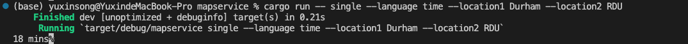
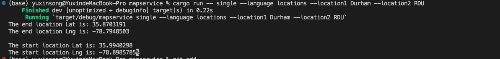

# rust-new-project-template
## Introduction
This is a course project from IDS721 cloud computing. This project aims to develop a useful command-line tool for data engineers based on Rust. Specifically, user can just type into two location names and get useful information like Lat and Lng, travel time, etc.

## Usage
For local testing, user must use their own GogleMap API Key to succesful access the information. Or user can use the link to use the mapservice.

For local testing, cd to the mapservice folder and type in:
```
cargo run -- mapservice --function {locations, time, distance} --location1 [LOCATION_NAME] --location2 [LOCATION_NAME]
```

## Project Screenshots
For distance:

For time:

For Lat and Lng:

## Project plan
### Week One:
Start Projects and finish the basic functions.
### Week Two:
Finish the basic functions and test it.
### Week Three:
Fix bug and add more features.

## References
* [rust-cli-template](https://github.com/kbknapp/rust-cli-template)
